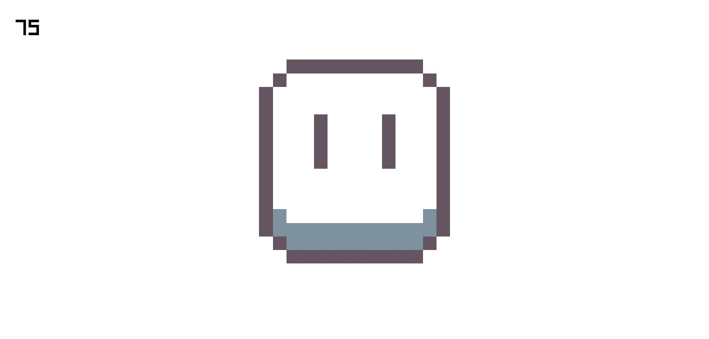
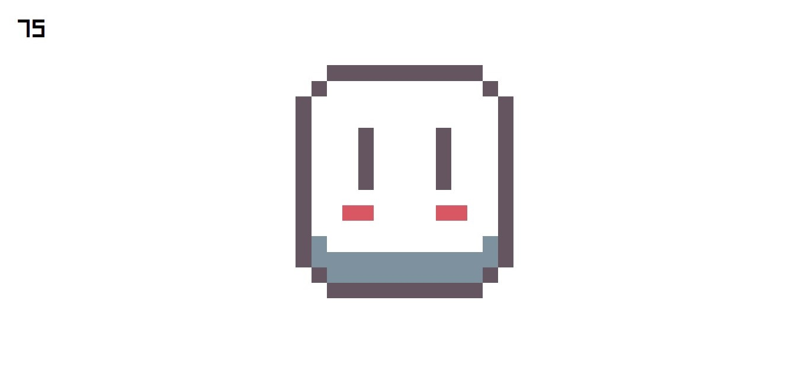
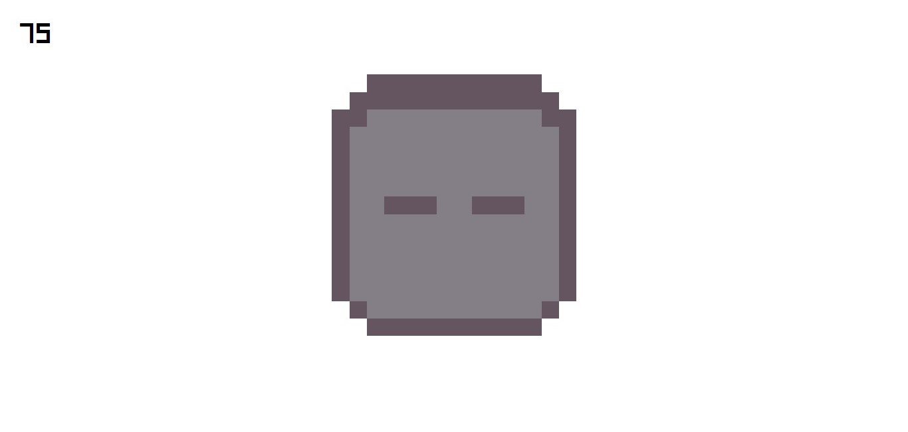

# Clicker Count

Coding In: CSS, HTML, JS
Repository: https://github.com/josh7bit/Button-Pixel
Status: Complete

## Description

It is a mini project of a button took by the icon of Aseprite

### Links

[Button Pixel](https://josh7bit-bottom-pixel.netlify.app/)

Page in Netlify

## States

**Normal**

**Hover**

Hover de mouse

**Press**

Click with a sound

